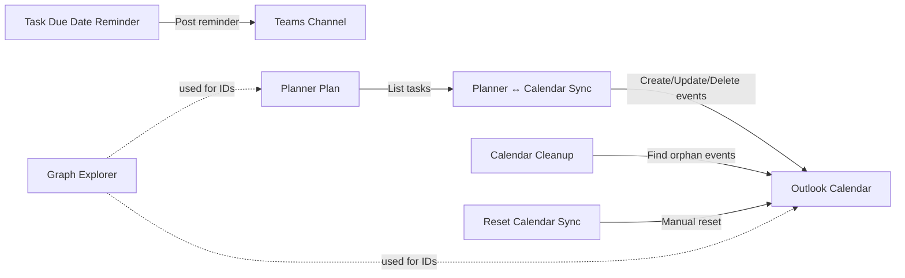

# KNIDiO Group Calendar Sync

Power Automate solution that synchronizes Microsoft Planner tasks with an Outlook calendar and adds operational reminders for task hygiene.

## Quick Links

- [Power Automate](https://make.powerautomate.com/)
- [Power Apps Solutions](https://make.powerapps.com/)
- [Microsoft Graph Explorer](https://developer.microsoft.com/graph/graph-explorer)
- [Microsoft Planner](https://planner.cloud.microsoft/)
- [Microsoft Teams](https://teams.microsoft.com/)
- [Microsoft 365 Admin Center](https://admin.microsoft.com/)

## What This Solution Includes

| Flow | Trigger | Purpose & Behavior |
|---|---|---|
| **Planner ↔ Calendar Sync** | Every 15 min | Syncs Planner tasks with due dates to Outlook calendar. Done tasks marked with ✅ emoji, in-progress tasks with 🔵 emoji. Each event includes task description and a direct link to the Planner task. Auto-creates when task gets due date, updates when details change, deletes when task is removed from plan. |
| **Calendar Cleanup** | Daily at 03:00 | Removes orphaned synced calendar events when Planner tasks no longer exist or have been deleted. Prevents stale events from accumulating. |
| **Reset Calendar Sync** | Manual button | Deletes all synced calendar events for a clean rebuild. Use after major Planner restructuring or to start fresh. |
| **Task Due Date Reminder** | Daily at 09:00 | Posts Teams channel reminder for: (1) assigned tasks missing a due date (excluding Reserve bucket), (2) completed tasks not yet moved to Done bucket. Messages tagged with @Zarząd for visibility. |

## Architecture

## Calendar Event Details

When the **Planner ↔ Calendar Sync** creates or updates an event:

- **Event Title**: Task title prefixed with emoji indicator:
  - `✅ Task Name` — Task is marked Complete in Planner
  - `🔵 Task Name` — Task is still In Progress in Planner
- **Event Description**: Full task description from Planner (if provided)
- **Event Body Link**: Direct hyperlink to the Planner task (clickable from calendar)
- **Event Time**: Based on task due date (all-day event)

Example: A task "Review budget proposal" marked In Progress appears as event `🔵 Review budget proposal` with description and Planner link.

## Deployment Guide

1. Open the solution folder and replace all placeholder values listed above.
2. Create a ZIP package while keeping the current directory structure.
3. Go to [Power Apps Solutions](https://make.powerapps.com/) and import the ZIP.
4. During import, map connection references:
- Office 365 Outlook
- Planner
- Teams
5. Enable all imported flows in [Power Automate](https://make.powerautomate.com/).
6. Run a manual smoke test:
- Trigger **Reset Calendar Sync** once (optional, clean start).
- Wait for **Planner ↔ Calendar Sync** to run.
- Verify events in Outlook calendar and reminders in Teams channel.

## Where To Get Required IDs

- **Group/Team ID**:
Use Teams "Get link to team" and copy `groupId` from the URL.
- **Plan ID**:
Open the plan in [Planner](https://planner.cloud.microsoft/) and copy the `planId` parameter from the URL.
- **Channel ID**:
Use Teams "Get link to channel" and copy the channel thread ID.
- **Calendar ID**:
Use [Graph Explorer](https://developer.microsoft.com/graph/graph-explorer) with:
`GET https://graph.microsoft.com/v1.0/me/calendars`
- **Bucket IDs**:
Use Graph Explorer with:
`GET https://graph.microsoft.com/v1.0/planner/plans/{planId}/buckets`

## Useful Graph Endpoints

- List calendars:
`GET /me/calendars`
- List Planner plans for a group:
`GET /groups/{groupId}/planner/plans`
- List tasks in a plan:
`GET /planner/plans/{planId}/tasks`
- List buckets in a plan:
`GET /planner/plans/{planId}/buckets`

## Security Note

This repository intentionally uses `YOUR_*` placeholders instead of tenant-specific IDs.
Keep real tenant identifiers in private configuration or local-only working copies.

## Troubleshooting

| Problem | Likely Cause | Fix |
|---|---|---|
| Import fails in Power Apps | Invalid ZIP structure | Rebuild ZIP with original root layout (`Workflows/`, `solution.xml`, etc.). |
| Flow import asks for missing connections | Connection references not mapped | Map Outlook, Planner, and Teams connections during import. |
| Sync flow runs but no events are created | Missing due dates or wrong IDs | Verify `YOUR_PLAN_ID`, `YOUR_CALENDAR_ID`, and that tasks have `dueDateTime`. |
| Cleanup deletes too much or too little | Wrong calendar ID or stale placeholders | Re-check placeholder replacement and confirm target calendar with Graph `/me/calendars`. |
| Reminder flow does not post to Teams | Wrong team/channel ID or permissions | Validate `YOUR_GROUP_OR_TEAM_ID` and `YOUR_CHANNEL_ID`; test connector access in Power Automate. |
| Push to GitLab is rejected | Remote changed since last push | Run `git pull origin main --rebase`, resolve conflicts, then push again. |

## Handy Validation Checklist

- Confirm no `YOUR_*` placeholders remain before production import.
- Verify all four flows are turned on after import.
- Create a test Planner task with a due date and confirm calendar sync.
- Mark a task complete outside Done bucket and confirm Teams reminder.

## License

MIT
